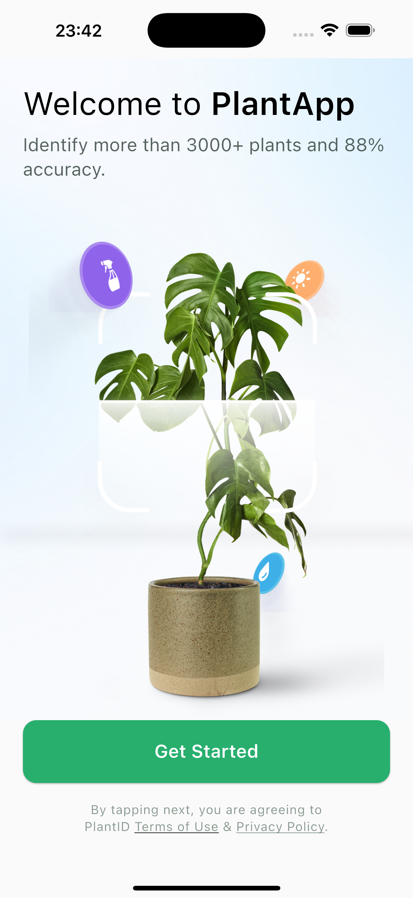
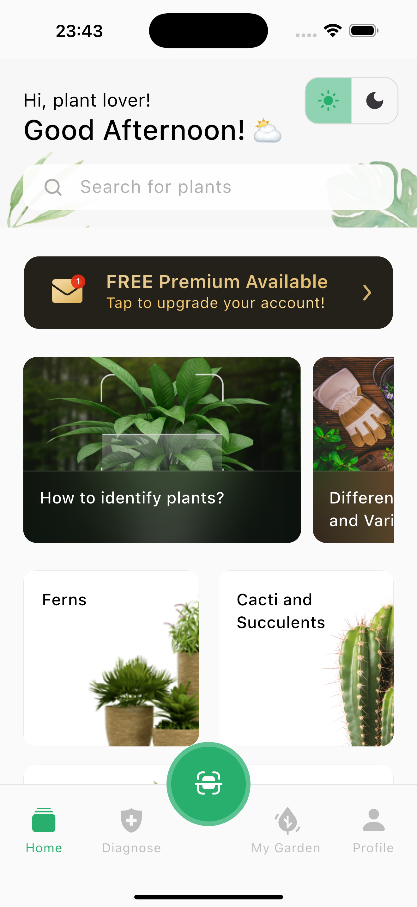
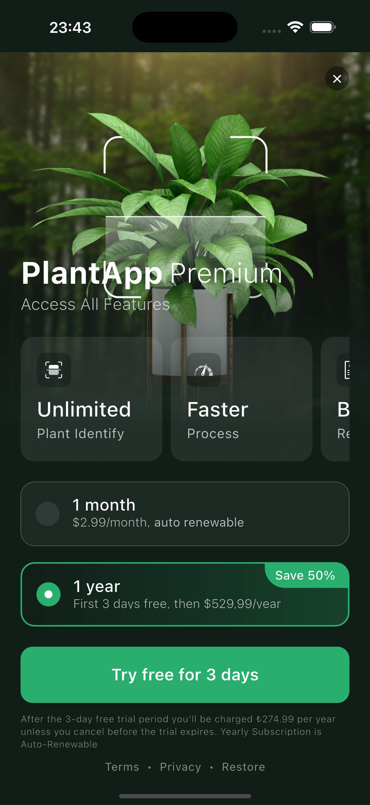
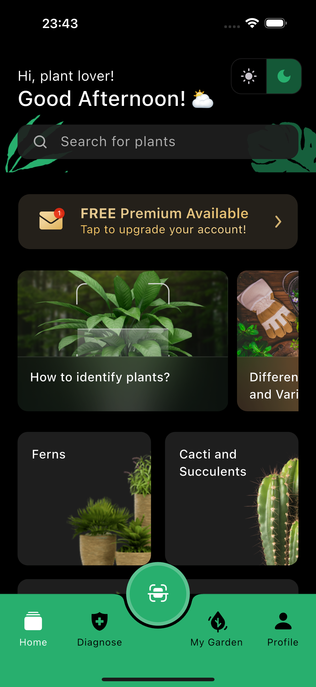

## PlantApp

A cross-platform Flutter app to identify and care for plants. It ships with a smooth onboarding, a home experience with bottom navigation, and a paywall for premium features. The app follows Clean Architecture with a feature-first structure, robust state management, strong theming, and CI-backed quality gates.

## Testing the app
- **Android**: Download the latest APK from the repository Releases page and install it on your device:
  - Download APK (v1.0.0): [app-release.apk](https://github.com/baros-code/PlantApp/releases/download/v1.0.0/app-release.apk)
  - Latest builds: [Releases](https://github.com/baros-code/PlantApp/releases)
  - On your Android device, enable installing from unknown sources if prompted, then open the downloaded `app-release.apk`.
- **iOS**: IPA builds require codesigning; build locally with Xcode.

## Main features
- **Onboarding**: Guides first-time users through key value props with responsive visuals.

  <p align="center">
    
  </p>

- **Home**: Bottom navigation shell hosting core features (Diagnose, My Garden, Profile).

  <p align="center">
    
  </p>

- **Paywall**: Subscription screen highlighting premium feature set and plans.

  <p align="center">
    
  </p>

- **Dark theme**: Full support for light/dark modes with consistent tokens.

  <p align="center">
    
  </p>

## Tech highlights
- **Pixel-perfect UI**: `flutter_screenutil` for responsive, device-consistent sizing.
- **Navigation**: `go_router` with a root `StatefulShellRoute` for bottom navigation.
- **State management**: `bloc`/`cubit` for predictable state.
- **Networking**: `dio`-based `ApiManager` with retry/http2 adapters.
- **Assets**: Auto-generated accessors via `flutter_gen_runner`.
- **Models**: `json_serializable` for compile-time JSON model generation.
- **App icons & splash**: `flutter_launcher_icons` for Android/iOS icons; native-like splash screens configured per platform.
- **Architecture**: Clean Architecture, feature-first folder structure.
- **Skeleton loading**: `skeletonizer` for smooth card placeholders.
- **Theming**: Light/Dark mode with design tokens in `AppTheme`.
- **Testing**: `flutter_test` + `mocktail` unit tests for use cases and cubits.
- **CI**: GitHub Actions (`.github/workflows/ci.yaml`) runs analyze and tests on every PR.
- **Linting**: Strong rules in `analysis_options.yaml` to enforce best practices.
 - **Local storage**: `shared_preferences` for lightweight persistence (e.g., onboarding seen).

## Tests
Unit tests cover:
- **Use cases**: onboarding flags, categories, questions
- **Cubits**: auth, home, paywall
- **Routing**: onboarding shown when `AuthOnboardingNotSeen` is emitted

## CI pipeline
GitHub Actions at `.github/workflows/ci.yaml`:
- **flutter_test**: `flutter analyze` + `flutter test`
- **build_android**: Builds AAB.
- **build_ios**: Builds iOS app and IPA (no codesign).

## Project structure (feature-first)
```text
lib/
  core/                # shared core (network, presentation base, utils)
  features/
    auth/              # onboarding flags, auth cubit, splash
    home/              # home domain/data/presentation
    paywall/           # premium features, subscription plans
    ...
  shared/              # theme, router, widgets
  gen/                 # flutter_gen generated assets
```

